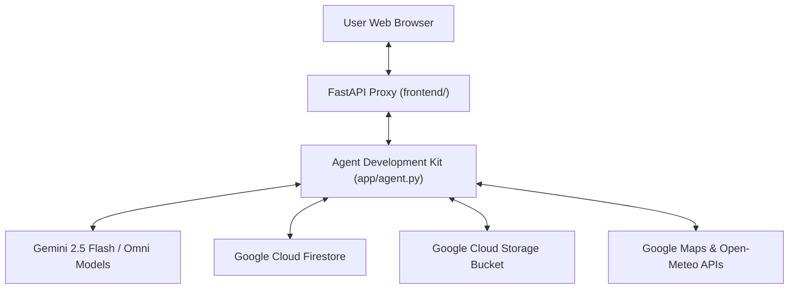

# Travel Planner AI Agent

A comprehensive, stateful travel planning assistant powered by the **Google Agent Development Kit (ADK)** and **Gemini 2.5 Flash**. The agent features real-time weather integration, destination search, trip budgeting, location geocoding, stateful memory persistence, interactive UI rendering (A2UI), AI image & video generation, and a custom web interface.


---

## 🌟 Key Features & Tool Audit

Based on the codebase in `app/` and `agents-cli-manifest.yaml`, the following tools and Google Cloud services are fully implemented:

### 1. 🗺️ Firestore Destination Database (`app/firestore_tools.py`)
- **`search_destinations`**: Search for travel destinations in Google Cloud Firestore by query term or category (e.g., Beaches, Culture, Nature, Foodie).
- **`get_destination_details`**: Retrieve full destination metadata, descriptions, and recommended activities from Firestore.
- **`add_destination`**: Persist new travel destinations and tags directly to the Firestore collection.

### 2. 🎨 AI Media Generation & Cloud Storage (`app/image_tools.py` & `app/video_tools.py`)
- **`generate_destination_postcard`**: Generates high-quality AI travel postcards using **Imagen 3** (`imagen-3.0-generate-002`).
- **`generate_destination_video`**: Generates short 3-second travel video previews using **Gemini Omni** (`gemini-omni-flash-preview`) in the `global` region via `client.interactions.create`.
- **Google Cloud Storage Bucket Integration**: Media bytes are directly uploaded in-memory to public Cloud Storage (`travel-planner-media-6a88f0f4`) and returned as public HTTPS URLs.
- **ADK Artifacts Panel**: Saves media artifacts via `ToolContext.save_artifact` so generated assets appear automatically in the ADK Playground Artifacts panel.

### 3. 📍 Google Maps & Location Services (`app/maps_tools.py`)
- **`geocode_address`**: Converts address strings into geographic latitude and longitude coordinates using the Google Maps Geocoding API.
- **`find_nearby_places`**: Discovers nearby tourist attractions, restaurants, and points of interest using the Google Maps Places API.

### 4. ☀️ Weather & Utilities (`app/agent.py`)
- **`get_weather`**: Retrieves live temperature, wind speed, and weather condition metrics for any destination via the Open-Meteo API.
- **`get_current_time`**: Looks up the current time and timestamp for any city or region.

### 5. 💰 Trip Budget & Currency Converter (`app/agent.py`)
- **`calculate_trip_budget`**: Calculates estimated total travel costs based on daily budget, duration, and number of travelers.
- **`convert_currency`**: Performs real-time currency conversions between standard ISO currency codes.

### 6. 🧠 Stateful Memory Bank (`app/agent.py`)
- **`PreloadMemoryTool` & `generate_memories_callback`**: Automatically extracts, persists, and preloads user travel preferences and memory items across multi-turn interactions.

### 7. 🧩 Interactive A2UI Component Cards (`app/a2ui_utils.py` & `app/agent.py`)
- **`a2ui_callback`**: Uses ADK model callbacks to transform agent responses into rich, interactive A2UI component catalog cards rendered directly inside supported frontends.

### 8. 💻 Plain Chat UI Web Application (`frontend/`)
- A minimal FastAPI web proxy and responsive front-end interface (`frontend/static/index.html`).
- Features a dark/light mode toggle, welcome onboarding card, quick category filter chips (`🏖️ Beaches`, `🏛️ Culture`, `🌲 Nature`, `🍜 Foodie`), rich bouncing dot typing indicators, and a 1-click itinerary copy button.

---

## 🏗️ Architecture Overview



---

## 🚀 Setup & Local Execution Instructions

### Prerequisites
- Python 3.10+
- `uv` package manager (`pip install uv` or `uv tool install google-agents-cli`)
- Google Cloud project with Vertex AI, Firestore, and Cloud Storage APIs enabled.

### 1. Installation
Clone the repository and install dependencies using `uv`:

```bash
uv sync
```

### 2. Environment Configuration
Create a `.env` file in the project root based on `.env.example`:

```bash
GOOGLE_CLOUD_PROJECT=your-gcp-project-id
GOOGLE_CLOUD_LOCATION=us-east1
GOOGLE_MAPS_API_KEY=your-google-maps-api-key
```

### 3. Seed Firestore Database (Optional)
To populate your Firestore database with initial destination data:

```bash
uv run python seed_firestore.py
```

### 4. Run Interactive Agent Playground
Test the agent logic and tools interactively using the CLI playground:

```bash
agents-cli playground
```

### 5. Run Web Application Locally
To start the plain chat UI web server locally:

```bash
cd frontend
uv run uvicorn main:app --host 0.0.0.0 --port 8080
```

Open a web browser and navigate to port `8080` on your machine to interact with the Travel Planner AI chat interface.

---

## 🧪 Running Unit & Integration Tests

Run the test suite with `pytest`:

```bash
uv run pytest tests/unit tests/integration
```
